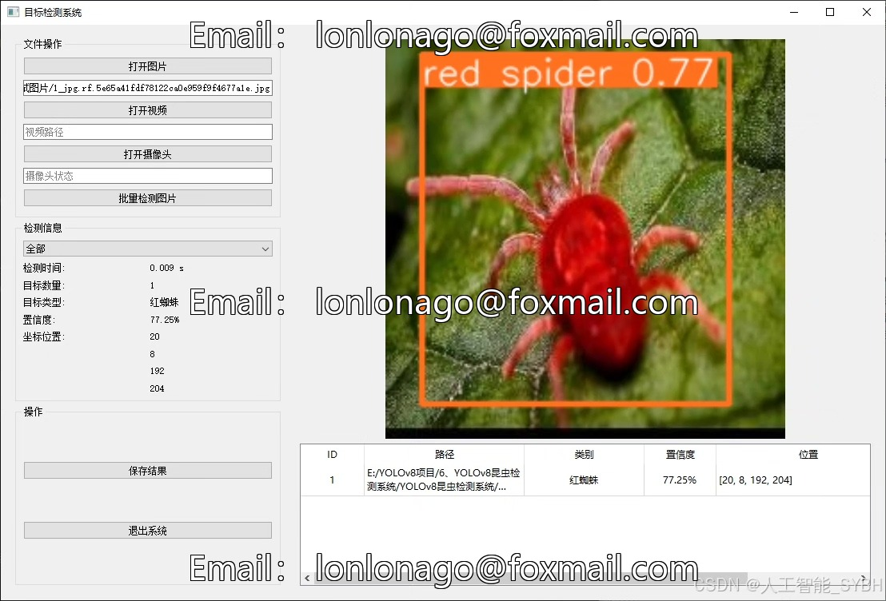
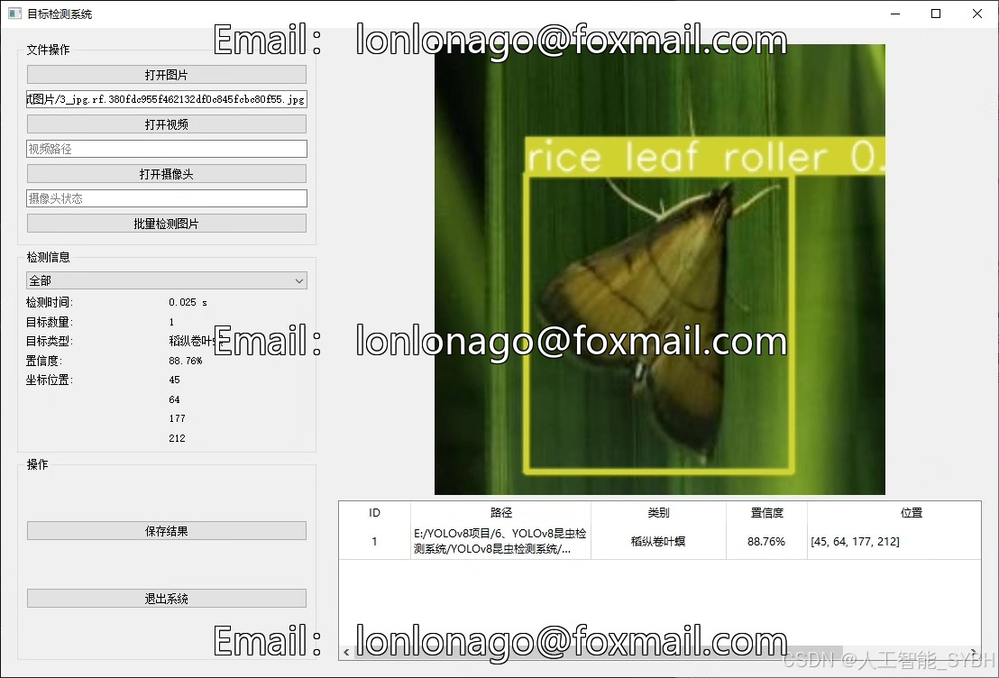
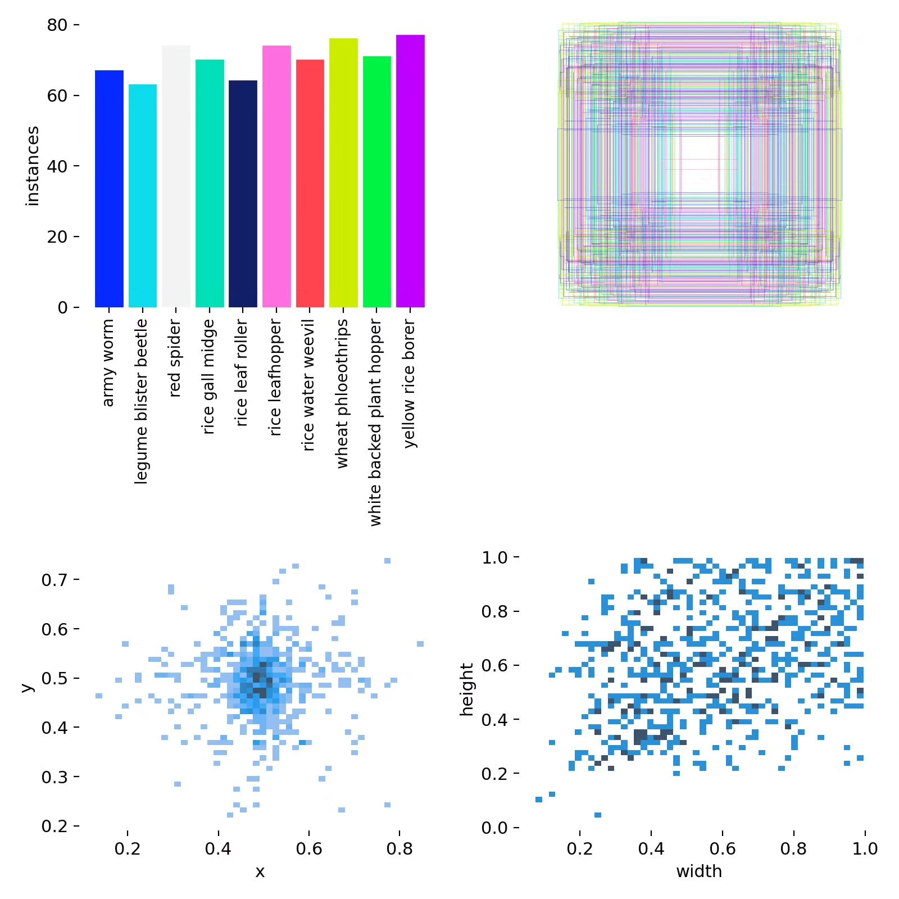
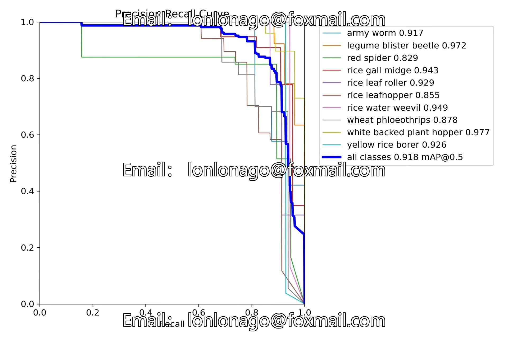
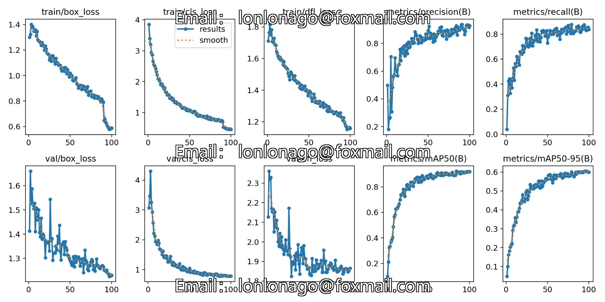
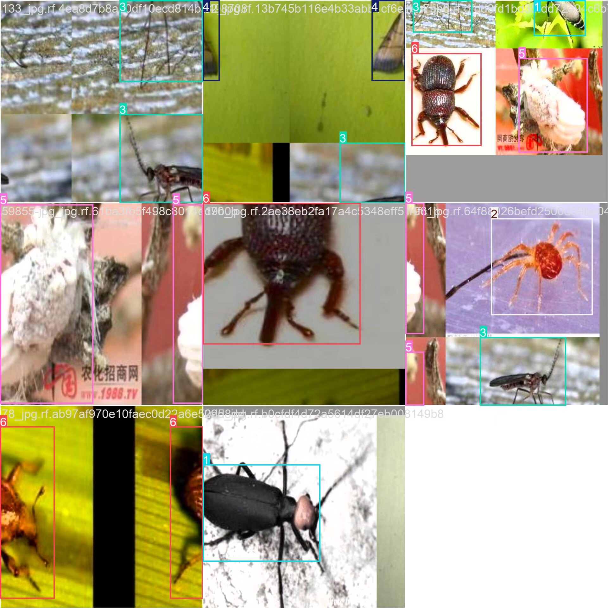
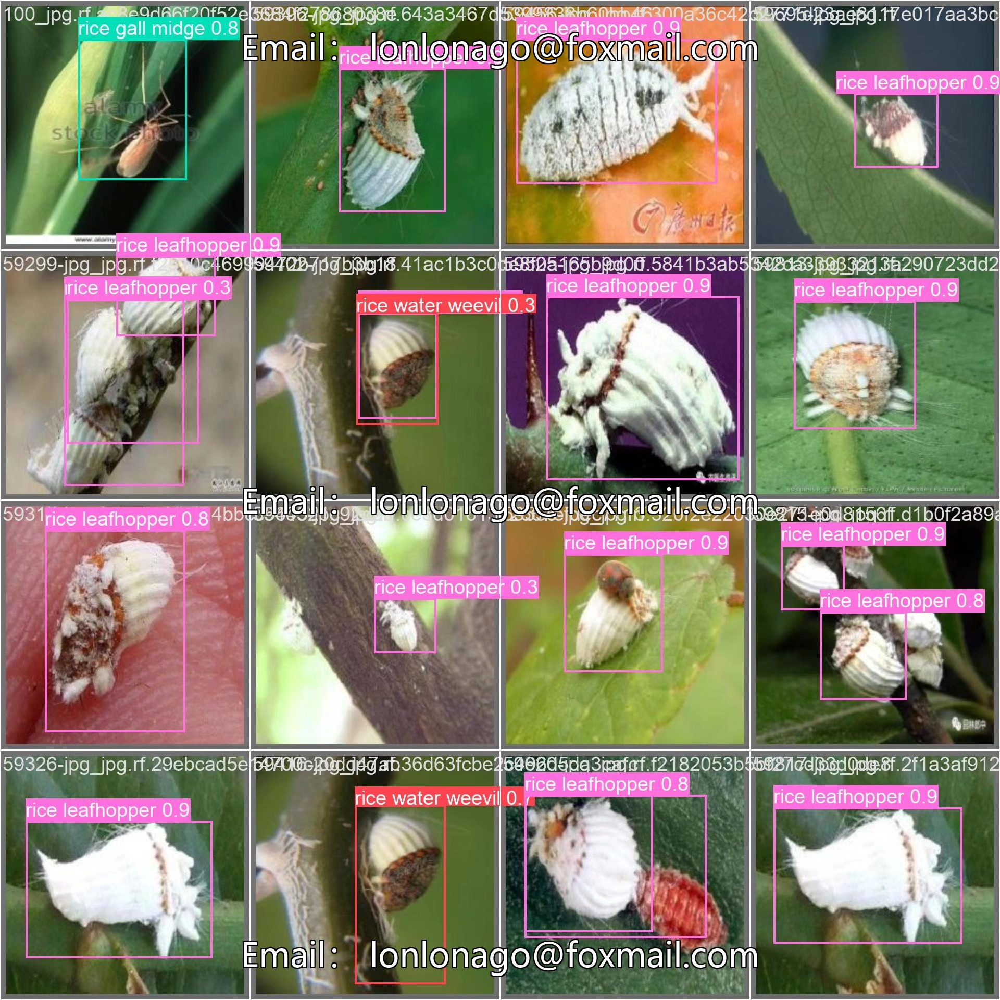

# Insect Detection System Based on YOLOv8 Deep Learning (YOLOv8+Y)

## Body

Based on the YOLOv8 deep learning framework, this project has developed a smart detection system specifically for agricultural pests. It can accurately identify 10 important agricultural pests, including 'army worm', 'legume blister beetle', 'red spider', 'rice gall midge', 'rice leaf roller', 'rice leafhopper', 'rice water weevil', 'wheat phloeothrips', 'white backed plant hopper', and 'yellow rice borer'. The system uses a professional dataset consisting of 696 training images, 199 validation images, and 100 test images to train and optimize, achieving high accuracy in identifying field pests.

The company's products have been granted the official commercial license certification by YOLO.

We provide after-sales service.

After payment, we will provide a WeChat account for any questions you may have.

Environmental configuration: We will provide a tutorial on how to set up the environment, and WeChat will provide answers to your questions.

Remote installation service: If you need remote configuration, an additional fee of 69 is required.
If the configuration fails, all fees will be refunded (only the installation fee is refundable for older computers).

Retraining dataset: After setting up the environment, you can train on your own computer.
If you need us to retrain, just pay 69 plus the computing power fee (2.5 yuan/hour).

Full after-sales service

## Images

## Payment

Here is a pay link on Stripe ( https://buy.stripe.com/3cs8yP7sY87d0vu9AB ). Please contact me lonlonago@foxmail.com after funding $89, and I will send you a complete data files , thank you!

